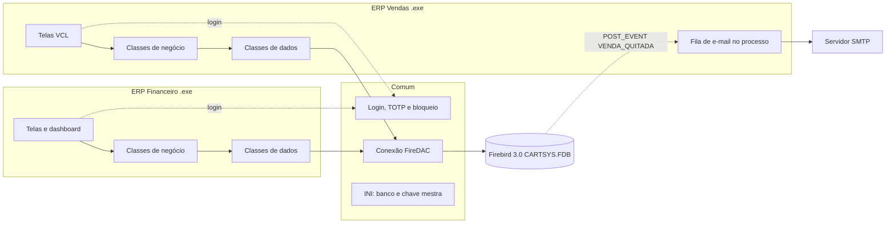
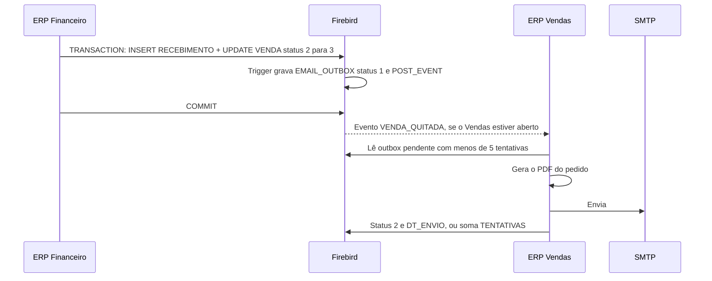
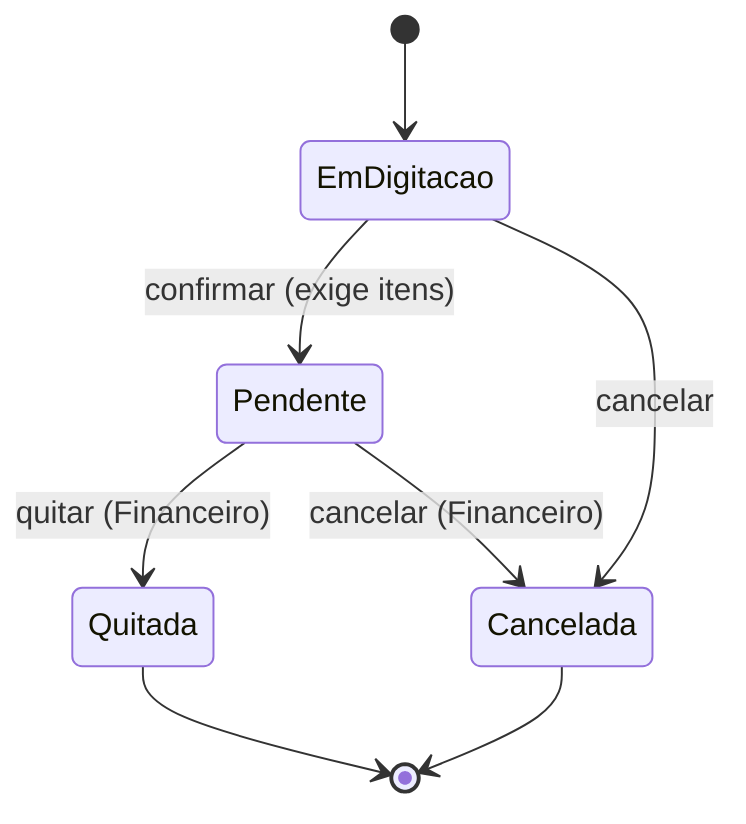
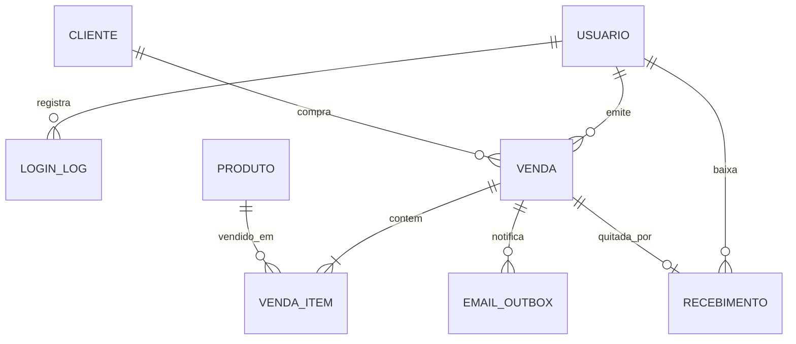

# CartSys – arquitetura e modelo de dados

ERP Vendas e ERP Financeiro em Delphi (10.3, 12 ou 13), FireDAC, Firebird 3.0, VCL e ReportBuilder.

## 1. Visão geral

Dois executáveis compartilham um único banco Firebird e as units de `Comum`. Um não chama o outro. A quitação integra pelo banco: uma outbox gravada na mesma transação e o evento `VENDA_QUITADA`.



### Stack

| Necessidade | Solução |
|---|---|
| Telas e grades | VCL (`TDBGrid`, `TEdit`, `TButton`). DevExpress não entrou: o trial não compilou packages no Delphi 13 Community |
| Acesso a dados | FireDAC (`TFDConnection`, `TFDQuery`, `TFDTransaction`) |
| Relatórios | ReportBuilder (pedido de venda e relatório financeiro) |
| Dashboard | Cartões em `TPanel`, barras desenhadas num `TPaintBox`, rankings em `TDBGrid` |
| QR Code do TOTP | `DelphiZXingQRCode`, com a chave também em texto |
| E-mail | Indy (`TIdSMTP`). TLS usa OpenSSL 1.0.2 de 32 bits: `libeay32.dll` e `ssleay32.dll` ao lado do `ERP_Vendas.exe` |
| Eventos do banco | `TFDEventAlerter` |
| Hash da senha | PBKDF2-HMAC-SHA256 em `uSenha` (`System.Hash`) |
| Cifra | AES-CBC + HMAC pela `bcrypt.dll` do Windows, em `uCripto`. Serve ao segredo TOTP e à senha SMTP |

## 2. Estrutura da solução

`Comum` entra pelo search path, não por BPL. Cada `.exe` sai sem runtime extra.

```
CartSys/
├─ CartSys.groupproj
├─ Banco/                      schema, dados de teste, ajustes e INI de exemplo
├─ Docs/
├─ Comum/
│   ├─ uConexao.pas            TFDConnection e transações
│   ├─ uConfig.pas             INI (banco, fallback de SMTP, chave mestra)
│   ├─ uSenha.pas              PBKDF2
│   ├─ uTotp.pas               TOTP e Base32
│   ├─ uCripto.pas             AES da chave mestra
│   ├─ uAutenticacao.pas       login, bloqueio, desbloqueio
│   ├─ uLogin.pas / .dfm       login e pareamento
│   ├─ uTrocaSenha.pas         troca da senha temporária
│   ├─ uQrCode.pas             desenho do QR
│   ├─ uDados.pas              helpers de SQL, arredondamento e busca sem acento
│   └─ uTipos.pas              status, forma de pagamento, limites
├─ Vendas/
│   ├─ ERP_Vendas.dpr
│   ├─ uPrincipal.pas          menu; abre a tela de SMTP
│   ├─ uClientes.pas, uCadCliente.pas, uConsultaCliente.pas
│   ├─ uProdutos.pas, uCadProduto.pas, uConsultaProduto.pas
│   ├─ uVendas.pas, uCadVenda.pas
│   ├─ uRelPedido.pas
│   ├─ uClienteDAO.pas, uProdutoDAO.pas, uVendaDAO.pas
│   ├─ uConfigEmail.pas        tela E-mail (SMTP) e envio de teste
│   ├─ uSmtpConfig.pas         CONFIG_SMTP (carga, gravação, cifra)
│   └─ uEnvioEmail.pas         leitura da outbox e SMTP
└─ Financeiro/
    ├─ ERP_Financeiro.dpr
    ├─ uSetup.pas              ERP_Financeiro.exe /setup
    ├─ uPrincipal.pas
    ├─ uQuitacao.pas, uQuitacaoBaixa.pas
    ├─ uConsultaFinanceira.pas
    ├─ uDashboard.pas, uDashboardDAO.pas
    ├─ uRelFinanceiro.pas
    ├─ uUsuarios.pas, uCadUsuario.pas
    └─ uFinanceiroDAO.pas, uUsuarioDAO.pas
```

## 3. Organização do código

A separação que importa é tela e acesso a dados.

| Elemento | Responsabilidade | Regra |
|---|---|---|
| Units de tela | Exibição, captura e validação | Sem SQL de negócio |
| Classes `*DAO` | SQL, transação e regra da entidade | Único lugar com `TFDQuery` de negócio |
| `Comum` | Conexão, senha, TOTP, INI | Sem dependência das telas dos apps |

Consultas parametrizadas, `Currency` para dinheiro, transação explícita na venda com itens e na quitação, mensagem de negócio na exceção e `try/finally` na liberação.

## 4. Autenticação e segurança

O login é no mesmo formulário, em duas etapas:

1. Login e senha.
2. Se `BLOQUEADO = 1`, nega antes do resto.
3. Senha com PBKDF2-HMAC-SHA256, salt por usuário, 210.000 iterações.
4. Código TOTP de 6 dígitos.
5. Sucesso zera `FALHAS_CONSECUTIVAS`. Falha em qualquer fator incrementa. Na terceira seguida, `BLOQUEADO = 1`.
6. A tela mostra mensagem genérica. O detalhe fica em `LOGIN_LOG`.

TOTP (RFC 6238): HMAC-SHA1, passo de 30 s, 6 dígitos, tolerância de dois passos para cada lado. O segredo Base32 fica em `TOTP_SEGREDO_CIFRADO`. `TOTP_ULTIMO_PASSO` impede reuso do mesmo código. O pareamento usa `otpauth://totp/CartSys:<login>?secret=...&issuer=CartSys`, em QR e em texto. Funciona com Microsoft Authenticator, Google Authenticator e equivalentes.

A chave mestra vem de `[Totp] ChaveMestraBase64` (32 bytes). Ela decifra o segredo TOTP e a senha SMTP. Não fica no banco.

No primeiro acesso o usuário nasce com senha temporária e `TOTP_CONFIRMADO = 0`. Depois da senha, a tela mostra o QR e só marca `TOTP_CONFIRMADO = 1` com um código válido. Aí pede a senha definitiva.

O desbloqueio está no Financeiro, restrito a `IS_ADMIN`. Zera as falhas, limpa `BLOQUEADO` e grava `LOGIN_LOG` (resultado 6, com `ADMIN_ID`). Os dois módulos leem a mesma `USUARIO`, então o bloqueio vale para os dois.

O hash e o segredo TOTP não vão escritos à mão no SQL. Com `USUARIO` vazia, `ERP_Financeiro.exe /setup` cria o administrador.

## 5. Integração Vendas e Financeiro



A outbox nasce na mesma transação da quitação, então o pedido de e-mail não se perde se o processo cair depois do COMMIT. O `POST_EVENT` só é entregue depois do COMMIT, e some se ninguém estiver escutando. Por isso o Vendas também varre a fila ao abrir, a cada 60 segundos e ao salvar o SMTP.

Quem envia é o processo do Vendas, não um serviço. Com o programa fechado, a linha espera.

Status da `EMAIL_OUTBOX`: 1 pendente, 2 enviado, 3 falha encerrada. A leitura pega `STATUS = 1` e `TENTATIVAS < 5`.

SMTP incompleto não incrementa `TENTATIVAS`. O Vendas avisa uma vez e deixa a linha pendente. Falha real grava `ULTIMO_ERRO` (até 500 caracteres) e soma uma tentativa. Na quinta, o status vai para 3 e a linha sai da leitura. Cliente sem e-mail vai para o status 3 na hora. O botão Enviar teste não grava outbox: conecta, manda e encerra.

A configuração efetiva é a linha `CONFIG_SMTP` de `ID = 1`. A senha é `CifrarSegredo` com a chave mestra. O `[Smtp]` do INI só preenche o padrão quando essa linha ainda não existe. No salvamento, a chave `Senha` é apagada do INI carregado pelo Vendas.

Para devolver uma linha encerrada à fila, `STATUS` volta a 1 e `TENTATIVAS` a 0. É o que faz `Banco/CARTSYS_reenviar_outbox.sql` (o `VENDA_ID` do script é da base de quem for testar).

Na quitação o update é `UPDATE VENDA SET STATUS = 3 WHERE ID = :id AND STATUS = 2`. Com `RowsAffected = 0`, outra estação já alterou a venda. O trigger de transição é a segunda barreira. Cancelamento não insere outbox.

## 6. Ciclo de vida da venda



Itens e desconto só mudam em digitação. Venda confirmada não é excluída. Cancelar pede motivo. Estorno de quitada ficou de fora. Os triggers repetem essas regras para quem acessar o banco por fora.

## 7. Modelo de dados

DDL em `Banco/CARTSYS_schema_firebird3.sql`.



| Tabela | Papel |
|---|---|
| `USUARIO` | Credenciais, TOTP, permissão por módulo, falhas e bloqueio |
| `LOGIN_LOG` | Acessos, bloqueios e desbloqueios |
| `CLIENTE`, `PRODUTO` | Cadastros. Inativa em vez de excluir, para guardar o histórico |
| `VENDA`, `VENDA_ITEM` | Pedido e itens. Totais recalculados no banco. Preço do item é o da hora da venda |
| `RECEBIMENTO` | Uma quitação por venda: valor, forma, quem baixou |
| `EMAIL_OUTBOX` | Fila da quitação. Status 1, 2 ou 3, tentativas, último erro, datas |
| `CONFIG_SMTP` | Uma linha (`ID = 1`): servidor, porta, usuário, senha cifrada, TLS, remetente e nome |

Chaves `BIGINT` com `IDENTITY` no Firebird 3. Dinheiro em `NUMERIC`. Charset `UTF8`. Login com collation `UNICODE_CI`. `VL_TOTAL` é `COMPUTED BY`. CPF e CNPJ ficam só com dígitos; a validação é na aplicação. O desconto percentual do item é `NUMERIC(9,4)`; a tela arredonda o percentual em duas casas e o valor em dinheiro à parte, sem recalcular um a partir do outro.

## 8. Dashboard

| Indicador | Fonte |
|---|---|
| Pendentes e quitadas, quantidade e valor | `V_DASH_STATUS` (status 2 e 3) |
| Projetado | Soma do status 2 |
| Realizado | Soma do status 3 |
| Ticket médio | Média de `VL_TOTAL` das quitadas |
| Canceladas | Contagem do status 4 |
| Projetado x realizado por mês | `V_VENDAS_MES`, desenhado no `TPaintBox` |
| Top 5 produtos | `V_RANKING_PRODUTO` |
| Top 5 clientes | `V_RANKING_CLIENTE` |
| Formas de pagamento | `RECEBIMENTO` agrupado por `FORMA_PAGAMENTO` |

Projetado é venda confirmada e ainda não quitada. Realizado é quitada. O dashboard não tem filtro de período. O período fica na consulta financeira e no relatório.

## 9. Cuidados de ambiente

Na Community, o FireDAC pode recusar o Firebird por TCP e aceitar só o modo embedded. Se for o caso, os dois executáveis usam o mesmo `.fdb` com `Modo=Embedded`.

O Indy deste Delphi carrega `ssleay32.dll` e `libeay32.dll` (OpenSSL 1.0.2, 32 bits). Outra geração de DLL passa pelo teste como “OpenSSL não encontrado”.

A fila não anda com o Vendas fechado, e uma linha com 5 falhas não é relida até alguém reabrir o status e zerar as tentativas.
